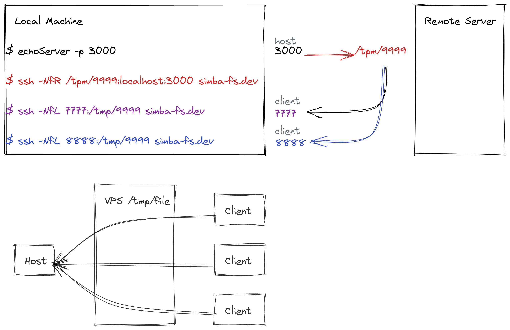

# STL (SSH Tunnel Lib, core library) usage

# SSH Tunnel 原理
  
ssh tunnel 必須由 client 和 host 發起，連線到 vps（server）。client 和 host 兩邊連線方式有一點不一樣，因為 ssh tunnel 不像 vps 是雙向的，他是單向的，分為「正向」(-L)和「反向」(-R)。  
不論是正向或是反向，都是將傳到某個 port 的 request 全部傳到另一個 port，正反向的差異是兩個 port 分別在本機還是遠端。  

> A 對映到 B --> 傳到 A 的 request 會被 ssh 轉送到 B

## 正向
將本地的某個 port A 對應到遠端的某個 port B，這個指令會讓 ssh 在本地打開 port A，把所有進到這個 port 的所有的 request 透過 ssh 轉到遠端的 port B，也就是說你去戳本地 port A，其實是在戳遠端的 port B。在我們的例子裡面就是 client 用的指令  

## 反向
和正向相反（廢話），反向會將遠端的 port B 對應到本地的 port A，ssh 會在遠端開 port B，所有進到遠端的 port B 的 request 都會被 ssh 轉送到本地的 port A。所以戳遠端的 port B 就是戳本地的 port A，這個效果就是將本地的 port 公開（如果遠端允許，sshd.conf 可以設定）  

> NOTE: 你也可以用 unix socket 代替 port，就直接填路徑就可以了（本地遠端都是）  

## ssh tunnel 類比 vpn 原理
先由 host 將遠端的某個 port 或是 unix socket 對映到本地伺服器的 port，讓戳那個 port 或 unix socket 等於在戳 Host。  
再由 client 將本地的 port 對應到遠端的 port，這個步驟可以操作多次，所以一組連線中可以有一個 host 和多個 client。
這樣戳 client 本地的 port 就等於戳 host 本地的 port。因此就可以有單向 vpn 的效果。

# client side
```
stl connect "host"|"client" <localPort:serverIP:serverPort>   -- establishes ssh tunnel
stl disconnect <port>                                         -- disconnects
stl key                                                       -- returns ssh publish key(stdout)
stl key renew                                                 -- generates a new pair of key, replace the old one
stl status                                                    -- sets status (client)
```

# server side
```
stl key add <key>          -- adds a ssh public key (only exec in server side)
stl key remove <keyMD5>    -- remove key be its sha256 hash
stl status [key]           -- gets status(on/off, uptime, reconnect times) according to ssh key (for server), returns all if key is not provided
```
